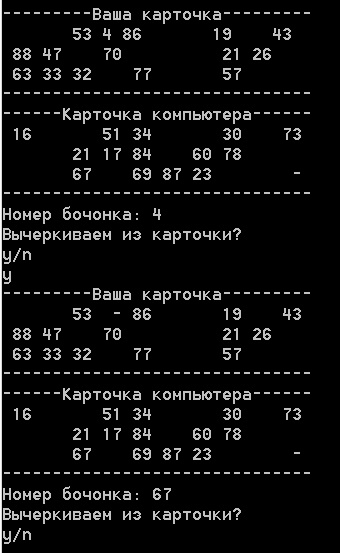

# Lotto_game
The OOP task.
<h3> Правила игры в лото. </h3>

 Игра ведется с помощью специальных карточек и бочонков с цифрами.
 

 Количество бочонков - 90 штук. Каждая карточка содержит 3 строки по 10 клеток. Все цифры в карточке уникальны.

В игре 2 игрока: пользователь и компьютер. Каждому игроку в начале игры выдается случайная карточка.

Каждый ход выбирается один случайный бочонок и выводится на экран. Пользователю предлагается зачеркнуть число на карточке (<b>y</b>) или продолжить (<b>n</b>).
 

Если число есть в карточке и игрок выбрал «зачеркнуть» - игра продолжается. В противном случае игрок проиграет.

Если числа нет в карточке и игрок выбрал «продолжить» - игра продолжится. В противном случае игрок так же проиграет.

Побеждает тот, кто первый закроет все числа в своей карточке.

<b>Пример:</b>

Запуск игры через bat-файл "lotto_run.bat". 
<h3>Rules of the lotto game.</h3> 

The game is played with the help of special cards and barrels with numbers.
 

The number of barrels is 90 pieces. Each card contains 3 rows of 10 cells. All the numbers in the card are unique.
 

There are 2 players in the game: a user and a computer. Each player is given a random card at the beginning of the game.
 

Each turn, one random barrel is selected and displayed on the screen. The user is asked to cross out the number on the card (<b>y</b>) or continue (<b>n</b>).
 

If the number is in the card and the player has chosen "strike out" - the game continues. Otherwise, the player will lose.

If the number is not in the card and the player has chosen "continue", the game will continue. Otherwise, the player will also lose. 

The winner is the one who first closes all the numbers in his card.
 
